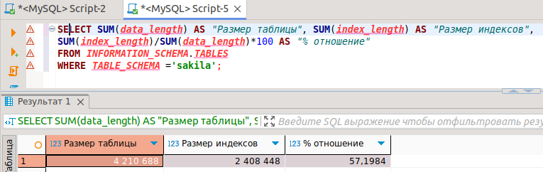
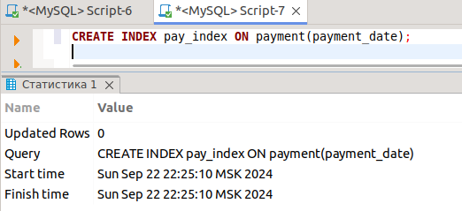
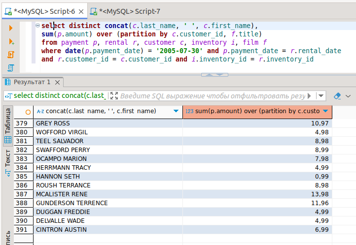
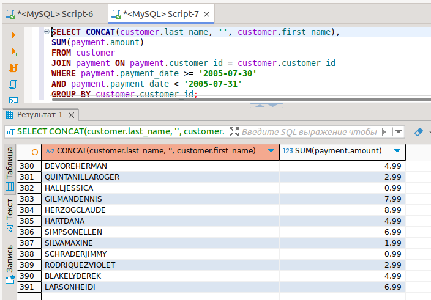

# Домашнее задание к занятию «Индексы» - 'Жаринов Павел'

### Задание 1

Напишите запрос к учебной базе данных, который вернёт процентное отношение общего размера всех индексов к общему размеру всех таблиц.
```
SELECT SUM(data_length) AS "Размер таблицы", SUM(index_length) AS "Размер индексов", 
SUM(index_length)/SUM(data_length)*100 AS "% отношение"
FROM INFORMATION_SCHEMA.TABLES
WHERE TABLE_SCHEMA ='sakila';
```


### Задание 2

Выполните explain analyze следующего запроса:
```sql
select distinct concat(c.last_name, ' ', c.first_name), sum(p.amount) over (partition by c.customer_id, f.title)
from payment p, rental r, customer c, inventory i, film f
where date(p.payment_date) = '2005-07-30' and p.payment_date = r.rental_date and r.customer_id = c.customer_id and i.inventory_id = r.inventory_id
```
- перечислите узкие места;
- оптимизируйте запрос: внесите корректировки по использованию операторов, при необходимости добавьте индексы.
```
CREATE INDEX pay_index ON payment(payment_date);

EXPLAIN ANALYZE
SELECT CONCAT(customer.last_name, '', customer.first_name), 
SUM(payment.amount)
FROM customer
JOIN payment ON payment.customer_id = customer.customer_id
WHERE payment.payment_date >= '2005-07-30'
AND payment.payment_date < '2005-07-31'
GROUP BY customer.customer_id;

-> Table scan on <temporary>  (actual time=1.58..1.62 rows=391 loops=1)
    -> Aggregate using temporary table  (actual time=1.55..1.55 rows=391 loops=1)
        -> Nested loop inner join  (cost=507 rows=634) (actual time=0.0634..1.25 rows=634 loops=1)
            -> Index range scan on payment using pay_index over ('2005-07-30 00:00:00' <= payment_date < '2005-07-31 00:00:00'), with index condition: ((payment.payment_date >= TIMESTAMP'2005-07-30 00:00:00') and (payment.payment_date < TIMESTAMP'2005-07-31 00:00:00'))  (cost=286 rows=634) (actual time=0.0332..0.691 rows=634 loops=1)
            -> Single-row index lookup on customer using PRIMARY (customer_id=payment.customer_id)  (cost=0.25 rows=1) (actual time=717e-6..735e-6 rows=1 loops=634)

```



